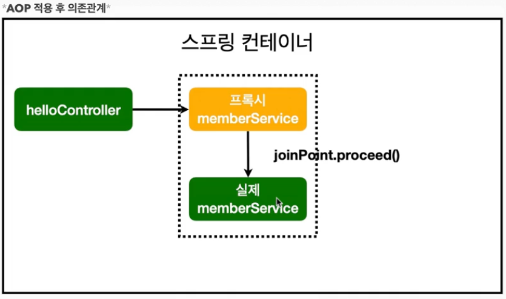

# AOP

## AOP가 필요한 상황
- 모든 메소드의 호출 시간을 측정하고 싶다면?
- 공통 관심 사항(cross-cutting concern) vs 핵심 관심 사항(core concern)
- 회원 가입 시간, 회원 조회 시간을 측정하고 싶다면?

```java
public class MemberService {
    public Long join(Member member) {
        long start = System.currentTimeMillis();

        try {
            validateDuplicateMember(member);
            memberRepository.save(member);
            return member.getId();
        } finally { // 예외가 떠도 시간을 찍어야 할때
            long finish = System.currentTimeMillis();
            long timeMs = finish - start;
            System.out.println("join = " + timeMs + "ms");
        }
    }
}
```
- 측정 코드를 모든 api 마다 붙이는 건 비효율적! 템플릿 메소드 패턴을 써서 공통 메소드로 만들 수 있지만, 복잡하다.

> 문제
- 회원 가입, 회원 조회에 시간을 측정하는 기능은 핵심 관심 사항이 아니다.
- 시간을 측정하는 로직은 공통 관심 사항이다.
- 시간을 측정하는 로직과 핵심 비즈니스의 로직이 섞여서 유지보수가 어렵다.
- 시간을 측정하는 로직을 별도의 공통 로직으로 만들기 매우 어렵다.
- 시간을 측정하는 로직을 변경할때 모든 로직을 찾아가면서 변경해야 한다.


## AOP 적용

메소드가 호출될때 마다 중간에서 인터셉터가 걸리는 것이다.

> 해결
- 회원가입, 회원 조회 등 핵심 관심사항과 시간을 측정하는 공통 관심 사항을 분리한다.
- 시간을 측정하는 로직을 별도의 공통 로직으로 만들었다.
- 핵심 관심 사항을 깔끔하게 유지할 수 있다.
- 변경이 필요하면 이 로직만 변경하면 된다.
- 원하는 적용대상을 선택할 수 있다.


- 스프링 빈에 직접 등록해줄때 2가지 방법이 있다.
  - 스프링 빈에 직접 등록해주기
  - @Component 어노테이션을 통해 컴포넌트 스캔되게 하기
  
```java
@Configuration
public class SpringConfig {

    @Bean
    public TimeTraceAop timeTraceAop() {
        return new TimeTraceAop();
    }
}
```

```java
@Aspect
@Component
public class TimeTraceAop {

    @Around("execution(* hello.hellospring..*(..))") // 패키지 하위에 다 적용하겠다는 의미
    public Object execute(ProceedingJoinPoint joinPoint) throws Throwable {

        long start = System.currentTimeMillis();
        System.out.println("START: " + joinPoint.toString());
        try {
            // 다음 메소드로 진행
            return joinPoint.proceed();
        } finally {
            long finish = System.currentTimeMillis();
            long timeMs = finish - start;
            System.out.println("END: " + joinPoint.toString() + " " + timeMs + "ms");

        }
    }
}
```

### 스프링의 AOP 동작 방법

- AOP 적용 후 의존관계



- AOP가 있으면 스프링이 가짜 스프링 빈을 컨테이너에 넣어둔다.
- helloController가 호출하는 건 진짜 memberService(진짜 스프링빈)가 아니라 ProxyMemberService(진짜 스프링빈)이다.
- 가짜 스프링빈이 끝나면 jointPoint.preoceed() 이후에 진짜 스프링빈이 나온다.

```
memberService = class hello.hellospring.service.MemberService$$EnhancerBySpringCGLIB$$1f8182c0
```

